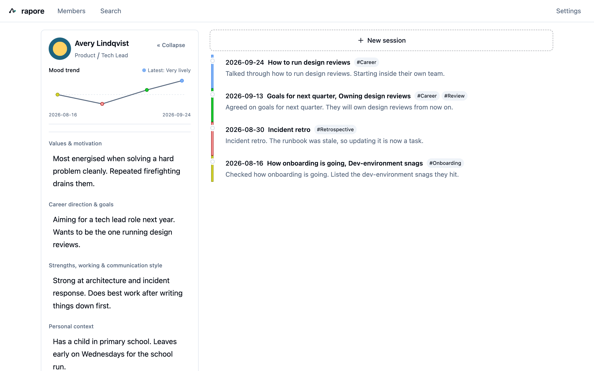
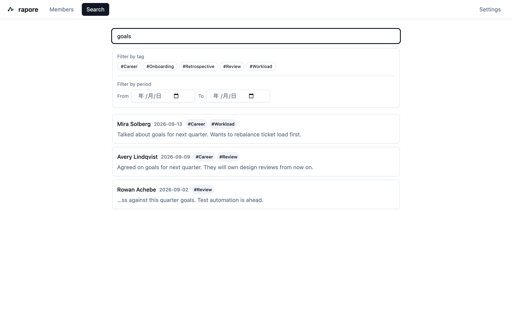
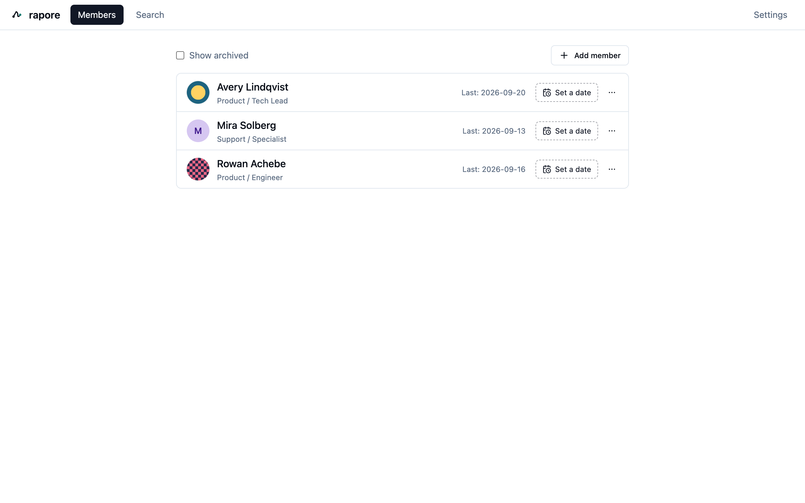

# rapore

[日本語](./README.md) | **English**

**A local-first, privacy-first desktop app for keeping 1-on-1 notes**

Keep a per-report history of your 1-on-1s and see who each person actually is — without waiting for your company to buy a tool. **Everything is stored in a SQLite file on your own machine and never leaves it.**

> The 1-on-1 notebook you can start on your own today, that keeps your reports' information off the internet.

*Member dashboard — who they are on the left, your 1-on-1 history on the right.*

## Download

Get the latest build from **[Releases](../../releases/latest)**.

| OS | File |
|---|---|
| macOS (Apple Silicon / M1 and later) | `rapore-<version>-arm64.dmg` |
| Windows 10 / 11 (64-bit) | `rapore-Setup-<version>-x64.exe` |

> ⚠️ This app is **not code-signed** yet, so macOS and Windows will warn you the first time you open it. Please read **[INSTALL.en.md](./INSTALL.en.md)** before installing.

## What it does

- **Manage your reports** — add, edit, archive, or delete permanently
- **Record 1-on-1s** — date, notes (Markdown / WYSIWYG), topics, tags
- **Find past sessions fast** — a per-person timeline plus keyword search across everyone (notes, topics, tags), narrowed by person, tag, or date range
- **Today’s read** — record how someone seemed to you on a seven-level scale after each 1-on-1, and see the trend per person (it is your impression, not a performance rating)
- **Member photos** — give each person a photo so the list is easier to scan (images are stored on your machine too)
- **Member dashboard** — four profile fields (values & motivation / career direction & goals / strengths, working & communication style / personal context) shown next to the history
- **Stored locally** — SQLite on your machine. The exact path is shown in Settings. Nothing is transmitted. **Before an update changes how records are stored, the app saves a full copy first** (the three most recent are kept)
- **English and Japanese** — follows your OS locale by default, switchable in Settings
- **AI access (optional, off by default)** — let the AI you already use (Claude Desktop, Claude Code, Cursor, Codex CLI, and so on) add and read your 1-on-1 records. Copy the snippet from Settings and paste it into your AI client. **Whatever your AI reads goes to that AI's provider** (see [INSTALL.en.md](./INSTALL.en.md) / [PRIVACY.en.md](./PRIVACY.en.md))
- **New-version notice (optional, off by default)** — when turned on, the app tells you when a new version is out. It asks only for the latest version number

## Screens

| | |
|---|---|
|  |  |
| **Search across everyone** — find sessions by notes, topics, or tags | **Member list** — your reports and upcoming 1-on-1s |

> The app shows you the full path to your data under **Settings → About**.

## Requirements

- macOS 12 or later (**Apple Silicon only. Intel Macs are not supported**)
- Windows 10 / 11 (64-bit)
- No internet connection required (used only if you turn on the new-version notice)

## Your data

- Everything is stored in a SQLite file on your machine and is never transmitted. With AI access turned on, rapore itself still sends nothing, but whatever your AI reads goes to that AI's provider. See **[PRIVACY.en.md](./PRIVACY.en.md)**.
- Session notes and profile fields are stored as **plain Markdown strings**, so you can always get them out. This is deliberate — we don't want to lock your data in.
- To back up, use **Settings → Backup → "Create a backup (.db)"**. **Copying the database file by hand is not recommended** — WAL mode means your most recent sessions may live in a separate file and would be missed. See [INSTALL.en.md](./INSTALL.en.md).
- ⚠️ Putting the database file **directly** into a Dropbox / iCloud / OneDrive folder can corrupt it for the same reason. Put a copy written by the app there instead.

## Bugs and requests

Please open an [Issue](../../issues).

## About this repository

**This repository is for distribution only. It does not contain source code.** rapore is closed-source software. What you'll find here is the built installers and this documentation.

- License: [LICENSE-EULA.en.md](./LICENSE-EULA.en.md)
- Open-source components: [THIRD-PARTY-NOTICES.md](./THIRD-PARTY-NOTICES.md)
- Release notes: [CHANGELOG.en.md](./CHANGELOG.en.md)
