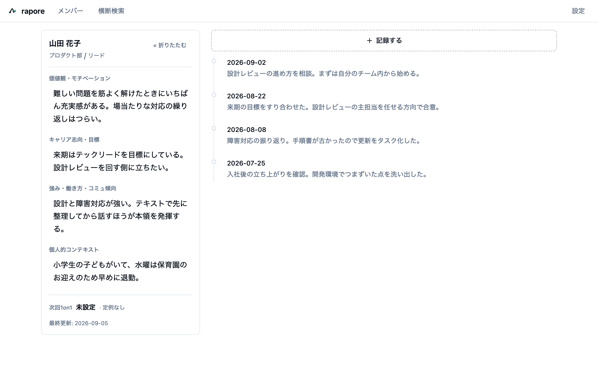
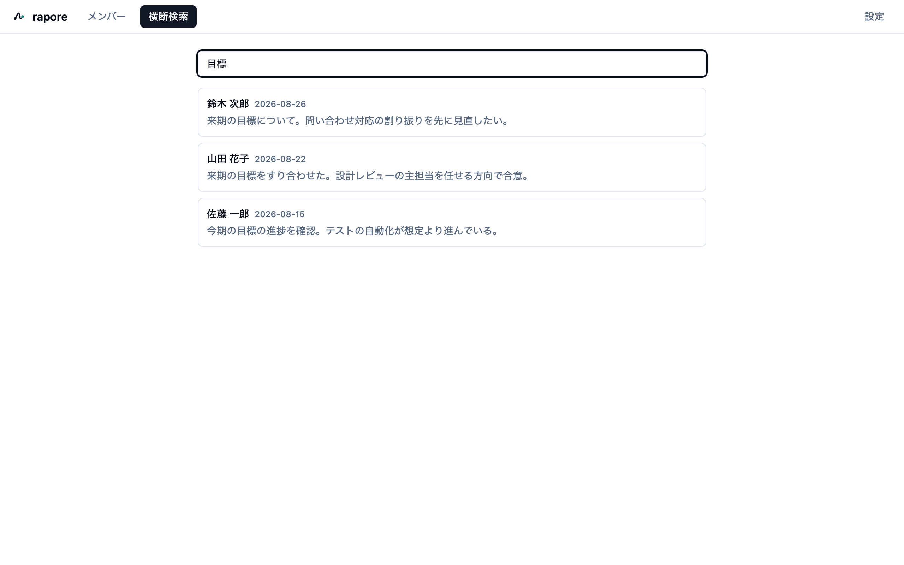
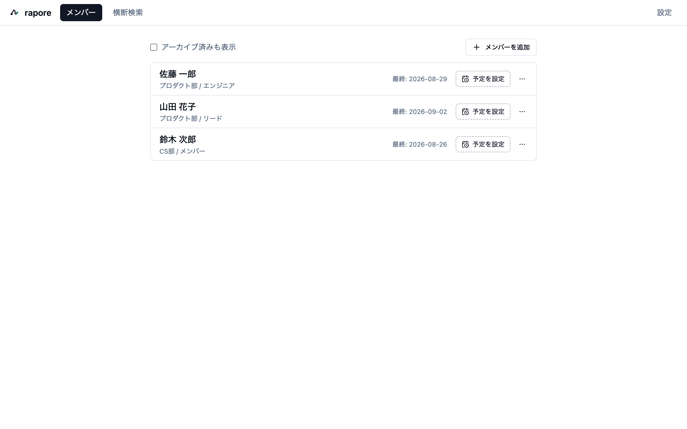

# rapore

**日本語** | [English](./README.en.md)

**ローカル完結・プライバシーファーストな 1on1 記録デスクトップアプリ**

会社のツール導入を待たず、個人マネージャーが「部下ごとの 1on1 履歴をすばやく参照」し、メンバーの「人となり」をダッシュボードで把握できます。**データはすべてあなたの端末内の SQLite ファイルに保存され、外部に送信されません。**

> 会社のツールを待たずに、今日から個人で始められる、部下の情報を外に出さない 1on1 ノート

*メンバーダッシュボード — 左に「人となり」、右に 1on1 の履歴。*

## ダウンロード

最新版は **[Releases](../../releases/latest)** から取得してください。

| OS | ファイル |
|---|---|
| macOS（Apple Silicon / M1 以降） | `rapore-<version>-arm64.dmg` |
| Windows 10 / 11（64bit） | `rapore-Setup-<version>-x64.exe` |

> ⚠️ 現在このアプリは**コード署名を行っていません**。初回起動時に macOS / Windows の警告が出ます。開き方は **[INSTALL.md](./INSTALL.md)** を必ずお読みください。

## 主な機能

- **メンバー（部下）管理** — 追加・編集・アーカイブ・完全削除
- **1on1 セッション記録** — 面談日・本文（Markdown / WYSIWYG エディタ）・トピック・タグ
- **履歴の高速参照** — メンバー別タイムライン、横断キーワード検索（本文・トピック・タグ）
- **メンバーダッシュボード** — プロフィール4項目（価値観・モチベーション／キャリア志向・目標／強み・働き方・コミュニケーション傾向／個人的コンテキスト）と履歴を並べて表示
- **ローカル保存** — 端末内 SQLite。保存場所はアプリの設定画面で確認できます
- **日本語 / English** — 表示言語を切り替えできます（既定は OS のロケールに追従）

## 画面

| | |
|---|---|
|  |  |
| **横断検索** — 全メンバーの記録を本文・トピック・タグから探す | **メンバー一覧** — 部下と次回1on1の予定 |

> データの保存場所は、アプリの **設定 → このアプリについて** にフルパスで表示されます。

## 動作環境

- macOS 12 以降（**Apple Silicon 搭載機のみ。Intel Mac には対応していません**）
- Windows 10 / 11（64bit）
- インターネット接続は不要です

## データの取り扱い

- すべてのデータは端末内の SQLite ファイルに保存され、外部へ送信されません。詳しくは **[PRIVACY.md](./PRIVACY.md)**。
- 本文とプロフィールは**生の Markdown 文字列**として保存されるため、いつでも取り出せます（ロックインを避ける設計です）。
- バックアップは **設定 → バックアップ → 「バックアップを作成（.db）」** から行ってください。**DB ファイルを手でコピーするのは勧めません**（WAL モードのため、直近の記録が別ファイルに残っていて取りこぼします）。詳しくは [INSTALL.md](./INSTALL.md)。
- ⚠️ DB ファイルを Dropbox / iCloud 等の同期フォルダに**そのまま**置くと、同じ理由で破損することがあります。同期フォルダにはアプリが書き出した写しを置いてください。

## バグ報告・要望

このリポジトリの [Issues](../../issues) へお願いします。

## このリポジトリについて

**このリポジトリは配布専用です。ソースコードは含まれていません。** rapore はクローズドソースのソフトウェアであり、ソースコードは公開していません。ここに置いてあるのはビルド済みのインストーラとドキュメントだけです。

- 使用許諾: [LICENSE-EULA.md](./LICENSE-EULA.md)
- 利用している OSS の表示: [THIRD-PARTY-NOTICES.md](./THIRD-PARTY-NOTICES.md)
- 変更履歴: [CHANGELOG.md](./CHANGELOG.md)
